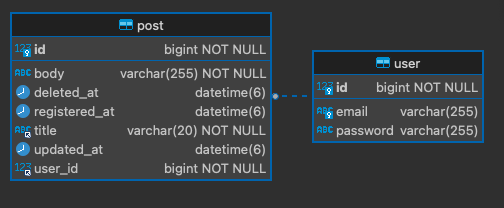

<!-- PROJECT LOGO -->
 

  <h3 align="center">원티드 프리온보딩 백엔드 인턴십 - 선발 과제</h3>

  

<!--     <a href="https://github.com/othneildrew/Best-README-Template">View Demo</a> -->
  

 

<!-- TABLE OF CONTENTS -->
  <ol>
    <li>
      <a href="#지원자-정보">지원자 정보</a>
    </li>
    <li>
      <a href="#애플리케이션-실행-방법">애플리케이션 실행 방법</a>
    </li>
    <li>
      <a href="#데이터베이스-테이블-구조">데이터베이스 테이블 구조</a>
    </li>
    <li>
      <a href="#구현-방법">구현 방법</a>
    </li>
     <li>
      <a href="#api-명세">API 명세</a>
    </li>
  </ol>

&nbsp;
&nbsp;
&nbsp;
&nbsp;

<!-- ABOUT THE PROJECT -->
## 지원자 정보

- 이름 : 이솔
- 이메일 : sadlthf@gmail.com

(<a href="#readme-top">back to top</a>)

&nbsp;
&nbsp;
&nbsp;
&nbsp;

## 애플리케이션 실행 방법
### deploy
- 도커 환경. 프로젝트 루트 경로에서
> docker-compose up --build -d

### 배포된 API 문서
> http://64.176.228.244:8080/swagger-ui/index.html

[Vultr](Vultr.com) 에서 spring boot와 mysql 을 각각 도커 컨테이너로 배포했습니다. 

### 엔드포인트 호출 방법
> http://64.176.228.244:8080/users/**
> 
> http://64.176.228.244:8080/posts/**

이런 식으로 API 명세서에 따라 호출합니다.

(<a href="#readme-top">back to top</a>)

&nbsp;
&nbsp;
&nbsp;
&nbsp;

## 데이터 베이스 테이블 구조

user, post를 1:n 관계로 매핑했습니다.

(<a href="#readme-top">back to top</a>)

&nbsp;
&nbsp;
&nbsp;
&nbsp;

## 구현 방법
### JWT 생성 
Bearer 헤더로 jwt 를 받아서 인증을 합니다. SecurityFilter 에 따로 정의한 JwtTokenFilter를 추가해서 JwtTokenFilter로 토큰을 확인합니다.  
token에는 유저의 email이 저장되어있습니다. token에서 추출한 email로 user를 조회하게됩니다.  
token의 유효기간은 30일로 정했습니다.

### 유효성 검사
유효성 검사는 `spring-boot-starter-validation` 을 이용해서 했습니다.  
jakarta.validation 어노테이션을 사용해서 필드마다 유효조건을 걸고 유효하지 못한 값이 들어왔을 때 던져지는 `MethodArgumentNotValidException` 을 `GlobalControllerAdvice` 가 받도록 구성했습니다. 

### 비밀번호 암호화
`PasswordEncoder` 를 이용해서 비밀번호를 암호화 했습니다. 로그인 했을 때, 비밀번호 일치 여부는 `PasswordEncoder` 가 제공하는 matches 메소드를 사용했습니다.

### Pagination
`스프링 프레임워크` 가 제공하는 `Page`, `Pageable` 을 사용해서 구현했습니다.   
`@PageableDefault` 어노테이션을 사용해서 default로 20개, 생성 시간 내림차순으로 조회하도록 설정했습니다. 

(<a href="#readme-top">back to top</a>)

&nbsp;
&nbsp;
&nbsp;
&nbsp;

## API 명세

### User API

* [회원가입](api-docs/user/join.md) : `POST /users/join`
* [로그인](api-docs/user/login.md) : `POST /users/login`

### Post API

* [게시글 생성](api-docs/post/create.md) : `POST /posts`
* [게시글 목록 조회](api-docs/post/list.md) : `GET /posts`
* [게시글 상세 조회](api-docs/post/detail.md) : `GET /posts/{postId}`
* [게시글 수정](api-docs/post/modify.md) : `PUT /posts/{postId}`
* [게시글 삭제](api-docs/post/delete.md) : `DELETE /posts/{postId}`

(<a href="#readme-top">back to top</a>)

&nbsp;
&nbsp;
&nbsp;
&nbsp;

